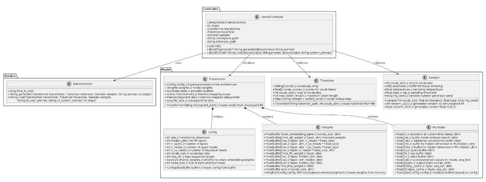
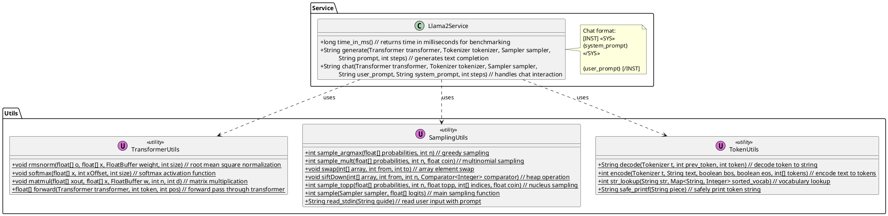
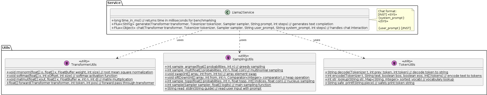

# Micronaut Llama2 Application

A high-performance Llama2 implementation using Micronaut and GraalVM Native Image.

## Getting Started
1. Clone the repository
```bash
git clone https://github.com/seehiong/micronaut-llama2.git
cd micronaut-llama2
```

2. Download required model files:
   - `stories15M.bin` (58MB) - Llama2 model checkpoint
   - `tokenizer.bin` (424KB) - Tokenizer data
   
   Place these files in the project root directory.

## API Documentation

### Generate Text
```http
GET /api/llama2/generate?prompt=<your_prompt>
```
Generates text completion based on the provided prompt.

### Chat
```http
GET /api/llama2/chat?prompt=<user_prompt>&system_prompt=<system_prompt>
```
Handles chat interaction with optional system prompt for context setting.

## Configuration
Key configuration options in `application.properties`:
```properties
# Model Configuration
llama2.checkpoint.path=stories15M.bin
llama2.tokenizer.path=tokenizer.bin
```

## Project Structure

```plaintext
llama2/
├── src/
│   └── main/
│       ├── java/
│       │   └── example/
│       │       └── micronaut/
│       │           ├── Application.java
│       │           ├── model/
│       │           │   ├── Config.java
│       │           │   ├── Weights.java
│       │           │   ├── RunState.java
│       │           │   ├── Transformer.java
│       │           │   ├── Tokenizer.java
│       │           │   └── Sampler.java
│       │           ├── utils/
│       │           │   ├── TransformerUtils.java
│       │           │   ├── TokenUtils.java
│       │           │   └── SamplingUtils.java
│       │           ├── service/
│       │           │   └── Llama2Service.java
│       │           └── controller/
│       │               └── Llama2Controller.java
│       └── resources/
│           ├── application.properties
│           └── logback.xml
└── build.gradle
```

## Architecture

### Control, Service and Model Package

```plantuml
@startuml
skinparam classAttributeIconSize 0

package "Controller" {
  class Llama2Controller {
    - Llama2Service llama2Service
    - int steps
    - Transformer transformer
    - Tokenizer tokenizer
    - Sampler sampler
    - String checkpoint_path
    - String tokenizer_path
    + void init()
    + @Get("/generate") String generate(@QueryValue String prompt)
    + @Get("/chat") String chat(@QueryValue String prompt, @QueryValue String system_prompt)
  }
}

package "Service" {
  class Llama2Service {
    + long time_in_ms()
    + String generate(Transformer transformer, Tokenizer tokenizer, Sampler sampler, String prompt, int steps)
    + String chat(Transformer transformer, Tokenizer tokenizer, Sampler sampler,\n            String cli_user_prompt, String cli_system_prompt, int steps)
  }
}

package "Model" {
  class Transformer {
    + Config config // hyperparameters of the architecture
    + Weights weights // model weights
    + RunState state // activation buffers
    + Arena memoryArena // memory mapping scope
    + MemorySegment data // memory mapped data pointer
    + long file_size // checkpoint file size
    + Transformer(String checkpoint_path) // loads model from checkpoint file
  }

  class Config {
    + int dim // transformer dimension
    + int hidden_dim // for ffn layers
    + int n_layers // number of layers
    + int n_heads // number of query heads
    + int n_kv_heads // number of key/value heads
    + int vocab_size // vocabulary size
    + int seq_len // max sequence length
    + boolean shared_weights // whether to share embedding weights
    + int head_size // size of each attention head
    + Config(ByteBuffer buffer) // reads config from buffer
  }

  class Weights {
    + FloatBuffer token_embedding_table // (vocab_size, dim)
    + FloatBuffer[] rms_att_weight // (layer, dim) rmsnorm weights
    + FloatBuffer[] wq // (layer, dim, n_heads * head_size)
    + FloatBuffer[] wk // (layer, dim, n_kv_heads * head_size)
    + FloatBuffer[] wv // (layer, dim, n_kv_heads * head_size)
    + FloatBuffer[] wo // (layer, n_heads * head_size, dim)
    + FloatBuffer[] rms_ffn_weight // (layer, dim)
    + FloatBuffer[] w1 // (layer, hidden_dim, dim)
    + FloatBuffer[] w2 // (layer, dim, hidden_dim)
    + FloatBuffer[] w3 // (layer, hidden_dim, dim)
    + FloatBuffer rms_final_weight // (dim)
    + FloatBuffer wcls // (vocab_size, dim)
    + Weights(Config config, MemorySegment memorySegment) // loads weights from memory
  }

  class RunState {
    + float[] x // activation at current time stamp (dim)
    + float[] xb // buffer inside residual branch (dim)
    + float[] xb2 // additional convenience buffer (dim)
    + float[] hb // buffer for hidden dimension in ffn (hidden_dim)
    + float[] hb2 // buffer for hidden dimension in ffn (hidden_dim)
    + float[] q // query buffer (dim)
    + float[] k // key buffer (dim)
    + float[] v // value buffer (dim)
    + float[] att // scores/attention values (n_heads, seq_len)
    + float[] logits // output logits (vocab_size)
    + float[][] key_cache // (layer, seq_len, dim)
    + float[][] value_cache // (layer, seq_len, dim)
    + RunState(Config config) // initializes buffers based on config
  }

  class Tokenizer {
    + String[] vocab // vocabulary array
    + float[] vocab_scores // scores for vocab items
    + int vocab_size // size of vocabulary
    + int max_token_length // maximum token length
    + Map<String, Integer> sorted_vocab // vocab lookup map
    + Tokenizer(String tokenizer_path, int vocab_size) // loads tokenizer from file
  }

  class Sampler {
    + int vocab_size // size of vocabulary
    + int[] probindex // buffer for top-p sampling
    + float temperature // sampling temperature
    + float topp // top-p sampling threshold
    + long rng_seed // random number generator seed
    + Sampler(int vocab_size, float temperature, float topp, long rng_seed)
    + int random_u32() // generates random 32-bit unsigned int
    + float random_f32() // generates random float in [0,1)
  }
}

Llama2Controller --> Llama2Service : uses
Llama2Controller --> Transformer : initializes
Llama2Controller --> Tokenizer : initializes
Llama2Controller --> Sampler : initializes

Transformer *-- Config : contains
Transformer *-- Weights : contains
Transformer *-- RunState : contains

@enduml
```




### Service and Utils Package




## Original Source

This project is a direct port of [llama2.java](https://github.com/mukel/llama2.java/tree/main) to a Micronaut application. The original implementation was contained in a single file `llama2.java` and was based on Andrej Karpathy's [llama2.c](https://github.com/karpathy/llama2.c).

### Original Implementation

The original implementation was structured as follows:

```java
public class Llama2 {
   static class Config { ... }
   static class Weights { ... }
   static class RunState { ... }
   static class Transformer { ... }
   static class Tokenizer { ... }
   static class Sampler { ... }
    
   // Utility functions
   static void rmsnorm(...) { ... }
   static void softmax(...) { ... }
   static void matmul(...) { ... }
   static float[] forward(...) { ... }
   static String decode(...) { ... }
   static int encode(...) { ... }
   static int sample(...) { ... }
   ...

   // Main generation logic
   static String generate(...) { ... }
   static String chat(...) { ... }
   ...
    
   public static void main(String[] args) { ... }
}
```

Our Micronaut implementation preserves this exact structure but organizes it into proper packages and classes, making it more maintainable and extensible while keeping the core logic intact.

### Changes from Original

The only modifications made were:
1. Restructuring the single file into a proper Micronaut project layout
2. Separating classes into individual files for better maintainability
3. Adding Micronaut endpoints for HTTP access
4. Using Gradle for dependency management

No algorithmic changes or optimizations were made to the original implementation. All core logic, including:
- Transformer architecture
- Tokenization
- Sampling strategies
- Memory management
- Matrix operations

remains exactly the same as in the original `llama2.java`.

The restructuring simply makes the codebase more maintainable and accessible as a web service, while preserving the efficient implementation of the original code.

## Class Descriptions

### Core Components

1. **Llama2Controller**
   - REST API endpoint controller
   - Manages initialization of model components
   - Handles text generation requests
   - Configures model parameters (temperature, top-p sampling)

2. **Llama2Service**
   - Core service for text generation
   - Handles token generation loop
   - Manages prompt processing and response generation
   - Provides timing utilities for benchmarking

3. **Transformer**
   - Main model architecture implementation
   - Memory-mapped model weights and configuration
   - Uses Foreign Memory API for efficient native memory access
   - Contains the model's weights, configuration, and runtime state

### Model Components

4. **Config**
   - Model architecture configuration
   - Defines dimensions, layer counts, attention heads
   - Vocabulary and sequence length parameters

5. **Weights**
   - Stores model parameters
   - Token embeddings
   - Attention and feed-forward weights
   - Memory-efficient using MemorySegments

6. **RunState**
   - Manages activation buffers
   - Stores intermediate computation results
   - Handles attention and feed-forward computations

### Text Processing

7. **Tokenizer**
   - Handles text-to-token conversion
   - Manages vocabulary and token scores
   - Implements BPE (Byte-Pair Encoding)

8. **Sampler**
   - Implements temperature-based sampling
   - Handles top-p (nucleus) sampling
   - Controls randomness in text generation

## Key Features

- GraalVM Native Image support for optimal performance
- Vector API integration for SIMD operations
- Micronaut AOT optimizations
- Build-time initialization of key components
- Monitoring support with heapdump and JFR
- Serial GC for Windows compatibility

## Build and Run

### Prerequisites
- GraalVM 22.0.2 or later
- Java 23 with preview features enabled
- Gradle 8.10 or higher

### Building the Native Image
```bash
./gradlew clean nativeCompile
```

The native executable will be generated at: `build/native/nativeCompile/application.exe`

### Running the Application
```bash
./build/native/nativeCompile/application.exe
```

## Configuration

### Parallelism Configuration
The application's parallelism (number of threads) can be configured in `application.properties`:
```properties
# Thread Configuration
java.util.concurrent.ForkJoinPool.common.parallelism=4
```

### Native Image Optimization Flags
- `--enable-preview`: Enables preview features like Vector API
- `--add-modules=jdk.incubator.vector`: Includes Vector API support
- `-march=x86-64`: Optimizes for the local machine architecture
- `--initialize-at-build-time`: Pre-initializes application classes
- `--enable-monitoring`: Enables heapdump and JFR support

### Memory Configuration
- Default heap settings: `-Xmx8g -Xms4g`
- Parallel processing: 8 threads

## Micronaut Documentation

## Micronaut 4.5.1 Documentation

- [User Guide](https://docs.micronaut.io/4.5.1/guide/index.html)
- [API Reference](https://docs.micronaut.io/4.5.1/api/index.html)
- [Configuration Reference](https://docs.micronaut.io/4.5.1/guide/configurationreference.html)
- [Micronaut Guides](https://guides.micronaut.io/index.html)
---

- [Shadow Gradle Plugin](https://plugins.gradle.org/plugin/com.github.johnrengelman.shadow)
- [Micronaut Gradle Plugin documentation](https://micronaut-projects.github.io/micronaut-gradle-plugin/latest/)
- [GraalVM Gradle Plugin documentation](https://graalvm.github.io/native-build-tools/latest/gradle-plugin.html)
## Feature serialization-jackson documentation

- [Micronaut Serialization Jackson Core documentation](https://micronaut-projects.github.io/micronaut-serialization/latest/guide/)


## Feature lombok documentation

- [Micronaut Project Lombok documentation](https://docs.micronaut.io/latest/guide/index.html#lombok)

- [https://projectlombok.org/features/all](https://projectlombok.org/features/all)


## Feature micronaut-aot documentation

- [Micronaut AOT documentation](https://micronaut-projects.github.io/micronaut-aot/latest/guide/)
